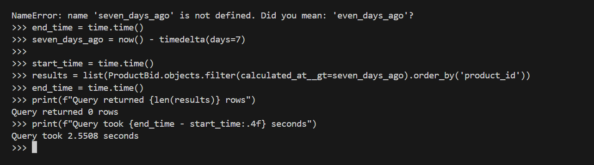
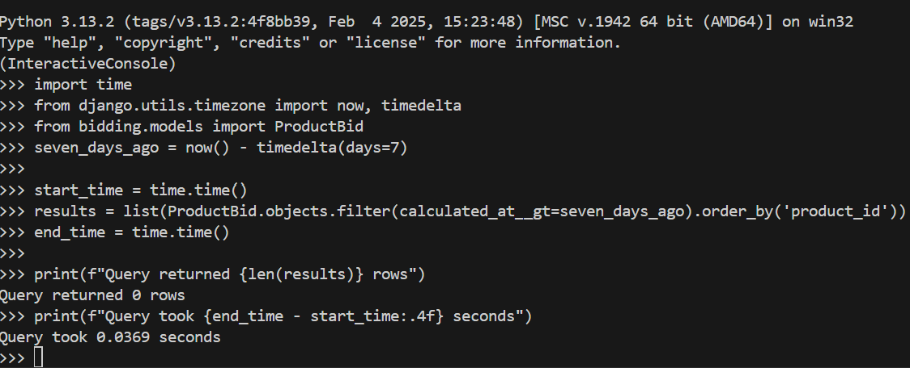

# 🧠 Django Bidding App

A Django-based ad-tech bidding application with REST API, async auditing, and containerized CI/CD. Designed to accept bids, calculate adjusted CPCs, flag anomalies, and run reliably in production with Docker + GitHub Actions.

---

## 🚀 Features

- RESTful endpoint to accept and process ad bids
- CPC adjustment using business logic
- Async audit tasks with Celery + Redis
- SQLite (dev)
- Linting with Ruff, testing with Pytest
- Dockerized deployment and CI via GitHub Actions

---

## 📦 Requirements

- Python 3.11+
- pipenv / pip + venv
- Docker & Docker Compose (optional)
- Redis (for Celery tasks)

---

## ⚙️ Installation (Local)

```python
git clone https://github.com/SriDeepthi92/Bidding_api.git
cd django-bidding-app

python -m venv venv
source venv/bin/activate

pip install -r requirements.txt

python manage.py migrate
python manage.py runserver
```

--- 
## 🔬 Performance Evidence: EXPLAIN ANALYZE

### ❌ Before Index

```sql
SELECT * 
FROM bidding_productbid 
WHERE calculated_at > now() - interval '7 days' 
ORDER BY product_id;
```
Output (approx): 2.5508 sec
---

---

### ✅ After Index
```sql
SELECT * 
FROM bidding_productbid 
WHERE calculated_at > now() - interval '7 days' 
ORDER BY product_id;
```
Output (approx): 0.0369 sec
---

---

### 🐳 Using Docker

docker-compose up --build
---

